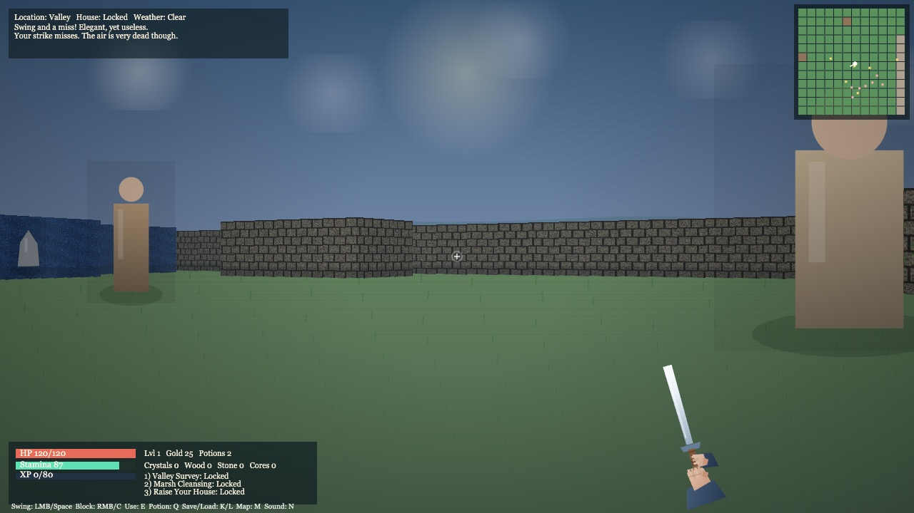

# Developer Portfolio

Modern personal portfolio built with React and styled for a polished product-engineering presentation.

## Live Site

- [GitHub Pages](https://coleyrockin.github.io/react-portfolio/)

## Current Screenshot



## What This Portfolio Highlights

- Professional project presentation with centered responsive cards
- Updated project visuals sourced from real project screenshots
- Grouped language map showing complete coding language coverage
- Certification section with Baylor and SMU credentials
- AI experience section focused on practical tooling and agent workflows
- Social-first contact section (Instagram, LinkedIn, GitHub)

## Recent Updates

- Rebranded profile language to **Developer** (removed full-stack phrasing)
- Added optimized local portfolio image pipeline under `src/assets/images/portfolio/` (uniform card-ready assets)
- Added centralized data modules:
  - `src/data/projects.js`
  - `src/data/languages.js`
- Refactored portfolio and knowledge sections to render from data modules
- Added CherryTree and refreshed core featured projects
- Improved link safety with `rel="noopener noreferrer"` on external links
- Added hash-based section routing for deep-linking and browser back/forward behavior
- Removed unused third-party script and improved metadata for SEO/social previews
- Added Baylor Java + Python certificate file to `public/certificates/`

## Tech Stack

- React 17
- React Scripts (Create React App)
- Custom CSS design system
- React Icons
- JavaScript (ES6+)

## Local Development

From the project root:

```bash
npm install
npm start
```

App URL in dev mode:

- [http://localhost:3000](http://localhost:3000)

## Build

```bash
npm run build
```

Creates an optimized production build in `build/`.
