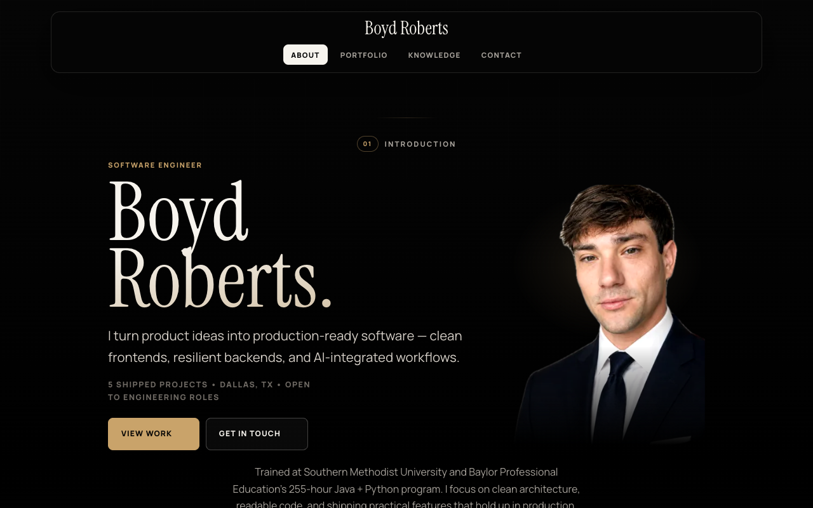

# Boyd Roberts — Software Engineer Portfolio

A modern, single-page portfolio built with **React 18** showcasing selected engineering work, technical depth, certifications, and AI workflow experience.

**[View Live Site →](https://coleyrockin.github.io/react-portfolio/)**

---

## Screenshot

<!-- Replace docs/screenshot.png with your own screenshot (see instructions below) -->


---

## Features

- **Hash-based routing** — deep-linkable sections with browser back/forward support
- **Responsive design** — mobile-first layout with glassmorphism nav and gradient backgrounds
- **Accessibility** — skip link, `aria-current` navigation, `prefers-reduced-motion` support, keyboard focus management
- **Data-driven rendering** — projects, languages, certifications, and social links all sourced from centralized data modules
- **PWA-ready** — web app manifest, themed favicons, OG/Twitter meta tags for social sharing
- **Subtle animations** — fade-in section transitions (disabled for reduced-motion preference)

## Sections

| Section | Description |
|---------|-------------|
| **About** | Professional summary, core stack highlights, and credential links |
| **Portfolio** | Six featured projects with screenshots, tech tags, and repo links |
| **Contact** | Social profile cards (GitHub, LinkedIn, Instagram) |
| **Knowledge** | Language map, engineering capabilities, certifications, and AI experience |

## Tech Stack

| Category | Technologies |
|----------|-------------|
| **Framework** | React 18, Create React App |
| **Styling** | Custom CSS design system with CSS custom properties |
| **Icons** | React Icons (Font Awesome) |
| **Fonts** | Bricolage Grotesque, Space Grotesk (Google Fonts) |
| **Deployment** | GitHub Pages via `gh-pages` |

## Project Structure

```
src/
├── App.js                    # Main app shell with hash routing
├── index.js                  # React 18 createRoot entry point
├── index.css                 # Full CSS design system
├── assets/images/            # Profile photo, badge, project screenshots
├── components/
│   ├── About/                # Bio, highlights, credential links
│   ├── Contact/              # Social profile grid
│   ├── Footer/               # Copyright + social icon links
│   ├── Nav/                  # Sticky glassmorphism navigation
│   ├── Portfolio/            # Project cards with image fallbacks
│   └── Resume/               # Language map, capabilities, certs, AI
├── data/
│   ├── iconMap.js            # Shared icon component mapping
│   ├── languages.js          # Language groups, capabilities, certs
│   ├── projects.js           # Featured project data
│   └── socialLinks.js        # Social profile links
public/
├── index.html                # HTML template with OG/Twitter meta
├── site.webmanifest          # PWA manifest
├── certificates/             # PDF credential files
└── images/                   # Favicons and app icons
```

## Local Development

```bash
# Install dependencies
npm install

# Start development server
npm start
```

Opens at [http://localhost:3000](http://localhost:3000).

## Build & Deploy

```bash
# Create optimized production build
npm run build

# Deploy to GitHub Pages
npm run deploy
```

## Capturing a Screenshot

To add the README screenshot:

1. Run `npm start` to launch the dev server
2. Open [http://localhost:3000](http://localhost:3000) in Chrome
3. Open DevTools → Device Toolbar → set viewport to **1280 × 800**
4. Navigate to the **About** section for the hero view
5. Take a screenshot (⌘⇧P → "Capture screenshot" in DevTools)
6. Save as `docs/screenshot.png`

## License

© 2026 Boyd Roberts. All rights reserved.
