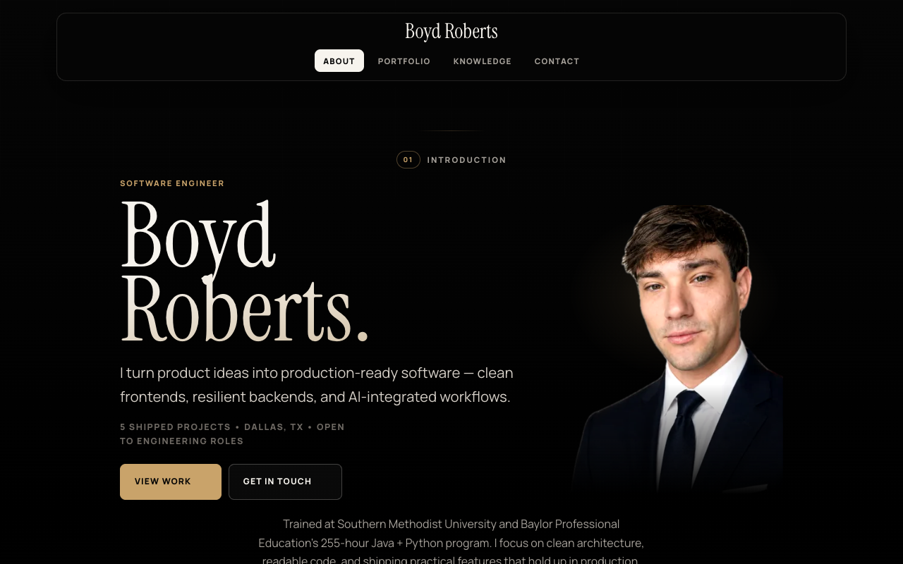

# Boyd Roberts — Developer Portfolio


**Live Site:** [coleyrockin.github.io/react-portfolio](https://coleyrockin.github.io/react-portfolio/)

---



---

## About

A single-page developer portfolio built with React 19 and Vite. Highlights selected engineering work, language breadth, certifications, and AI workflow experience — with hash-based deep linking, a theme-aware animated canvas hero, mobile-first responsive layout, and an accessibility-conscious component tree.

## Features

- **Hash-based routing** — deep-linkable sections with full browser back/forward support
- **Animated neural-canvas hero** — theme-reactive blob field rendered on HTMLCanvas with DPR scaling and `prefers-reduced-motion` fallback
- **Light / dark theme** — auto-detects `prefers-color-scheme`, persists preference, and swaps canvas palette in place
- **Responsive from 320px up** — mobile-first layout with glassmorphism nav and gradient backgrounds
- **Accessibility-first** — skip link, `aria-current` nav, reduced-motion support, keyboard focus management, semantic landmarks, descriptive alt text
- **Data-driven content** — projects, languages, certifications, and social links centralized in `src/data/*`
- **PWA-ready** — web app manifest, themed favicons, OG/Twitter meta, JSON-LD `Person` schema
- **CI/CD** — GitHub Actions runs lint + test + build on every push; separate workflow deploys to GitHub Pages

## Tech Stack

| Category | Technologies |
|----------|-------------|
| **Frontend** | React 19, JavaScript (ES2022), plain CSS |
| **Icons** | React Icons 5 |
| **Build** | Vite 8, @vitejs/plugin-react |
| **Testing** | Vitest 4, Testing Library (React 16, user-event 14), jest-dom 6, jsdom |
| **Linting** | ESLint 9 (flat config), `eslint-plugin-react`, `eslint-plugin-react-hooks`, `eslint-plugin-jsx-a11y` |
| **Formatting** | Prettier 3 |
| **CI/CD** | GitHub Actions (CI + Pages deploy) |
| **Deployment** | GitHub Pages |

## Getting Started

```bash
# Clone
git clone https://github.com/coleyrockin/react-portfolio.git
cd react-portfolio

# Install
npm install

# Start dev server at http://localhost:3000
npm run dev
```

### Available Scripts

| Command | Description |
|---------|-------------|
| `npm run dev` | Start Vite dev server on port 3000 |
| `npm run build` | Production build to `build/` |
| `npm run preview` | Preview the production build locally |
| `npm test` | Run the Vitest suite once |
| `npm run test:watch` | Run Vitest in watch mode |
| `npm run lint` | Lint `src/` with ESLint |
| `npm run lint:fix` | Lint and auto-fix |
| `npm run format` | Format `src/` with Prettier |
| `npm run check` | Lint + test + build (full CI pipeline) |
| `npm run deploy` | Manual deploy via `gh-pages` (CI usually handles this) |

## Project Structure

```
react-portfolio/
├── .github/workflows/    # CI + GitHub Pages deploy
├── public/               # Static assets, manifest, favicons, certificates
├── src/
│   ├── components/       # About, Portfolio, Contact, Resume, Nav, Footer, NeuralCanvas, RevealItem
│   ├── data/             # projects, languages, socialLinks, iconMap
│   ├── hooks/            # useInViewport (IntersectionObserver w/ reduced-motion guard)
│   ├── App.jsx           # Hash-routed shell
│   ├── App.test.jsx      # Integration tests
│   ├── index.jsx         # Entry point (React 19 createRoot)
│   └── index.css         # Global styles + theme variables
├── index.html            # Vite entry HTML
├── vite.config.js        # Build config (base: /react-portfolio/)
├── vitest.config.js      # Test env (jsdom + setupTests)
└── eslint.config.js      # ESLint flat config
```

## What this demonstrates

- Migrating a mature Create React App project to Vite + React 19 + Vitest without dropping test coverage
- Accessibility-conscious React (skip link, reduced-motion, semantic landmarks, keyboard-friendly nav)
- Canvas animation with DPR scaling, ResizeObserver-driven redraws, and theme-reactive color palettes
- CI-enforced quality gates (lint + test + build) before any deploy
- GitHub Actions Pages deploy pipeline (no push-to-gh-pages branch required)

## License

MIT © Boyd Roberts
