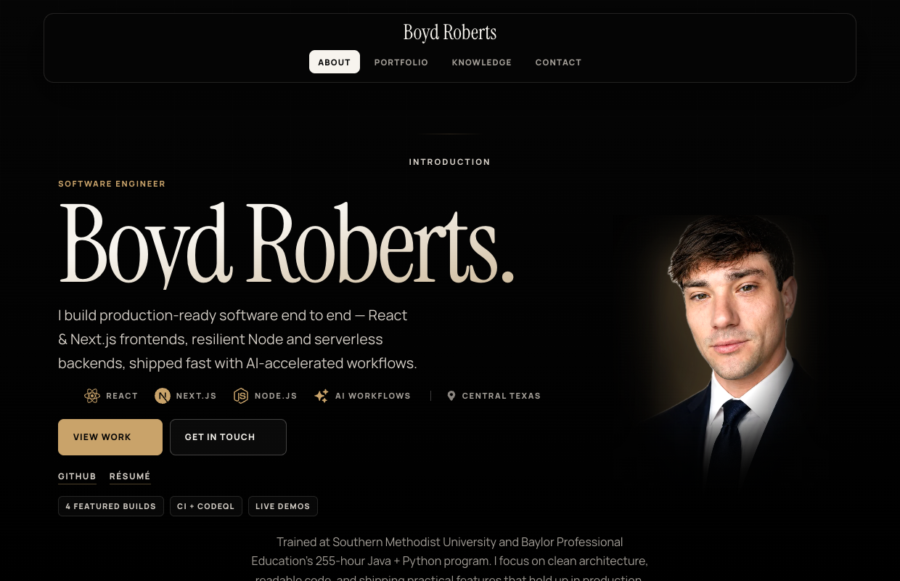

# Boyd Roberts — Developer Portfolio

[](https://github.com/coleyrockin/react-portfolio/actions/workflows/ci.yml)


**Live Site:** [coleyrockin.github.io/react-portfolio](https://coleyrockin.github.io/react-portfolio/)

> Single-page React 19 portfolio with hash-based sections, CI-enforced quality gates
> (format + lint + test + build), a strict production CSP, automated accessibility checks,
> and production-browser smoke coverage.

---



---

## About

A single-page developer portfolio built with React 19 and Vite.

Highlights selected engineering work, language breadth, certifications, and AI workflow experience — with hash-based deep linking, an editorial portrait hero, mobile-first responsive layout, and an accessibility-conscious component tree.

## Recruiter / Reviewer Quick Path

| Need              | Link or command                                                                          |
| ----------------- | ---------------------------------------------------------------------------------------- |
| Live portfolio    | [coleyrockin.github.io/react-portfolio](https://coleyrockin.github.io/react-portfolio/)  |
| Best project demo | [World Asset Prices](https://world-asset-prices.vercel.app)                              |
| Source code       | [github.com/coleyrockin/react-portfolio](https://github.com/coleyrockin/react-portfolio) |
| Validation        | `npm run check` and `VISUAL_SMOKE_PORT=4174 npm run visual:smoke`                        |

## Featured Project Links

| Project            | Live                                                                         | Source                                                      |
| ------------------ | ---------------------------------------------------------------------------- | ----------------------------------------------------------- |
| World Asset Prices | [world-asset-prices.vercel.app](https://world-asset-prices.vercel.app)       | [GitHub](https://github.com/coleyrockin/world-asset-prices) |
| Neon City Chess    | [neon-city-chess.vercel.app](https://neon-city-chess.vercel.app)             | [GitHub](https://github.com/coleyrockin/Chess-Game)         |
| POWO               | [proof-of-workout-next.vercel.app](https://proof-of-workout-next.vercel.app) | [GitHub](https://github.com/coleyrockin/POWO)               |
| CherryTree         | [cherry-tree-psi.vercel.app](https://cherry-tree-psi.vercel.app)             | [GitHub](https://github.com/coleyrockin/CherryTree)         |

## Features

- **Hash-based routing** — deep-linkable sections with full browser back/forward support
- **Editorial portrait hero** — optimized headshot treatment with credential badges and direct work/contact CTAs
- **Dark editorial design system** — ink, gold, and muted neutral tokens with serif display type and restrained motion
- **Release preview assets** — dedicated Open Graph/Twitter social preview image and refreshed README screenshot
- **Responsive from 320px up** — mobile-first layout with a fluid `clamp()` type scale
- **Accessibility-first** — skip link, `aria-current` nav, reduced-motion support, keyboard focus management, semantic landmarks, descriptive alt text
- **Data-driven content** — projects, languages, certifications, and social links centralized in `src/data/*`
- **Web app metadata** — manifest, themed favicons, OG/Twitter preview, and JSON-LD `Person` schema
- **CI/CD** — GitHub Actions runs format + lint + test + build on every push; separate workflow deploys to GitHub Pages

## Performance & Accessibility

The hero photo is a 720×1046 WebP with explicit dimensions, an image preload, and `fetchPriority="high"`. Project cards use 720w and 1280w WebP variants through `srcSet` and `sizes`; non-hero images are lazy-loaded. Manrope and Instrument Serif are self-hosted and preloaded, so the critical path has no third-party font dependency.

Deliberate accessibility choices, verified by integration, component, and `axe-core` tests:

- Skip link to `#main-content` as the first focusable element
- `aria-current="page"` on the active section button; focus moves to `<main>` and scroll resets to top on navigation
- Semantic landmarks (`<header>`, `<nav>`, `<main>`, `<footer>`) with labelled regions
- `prefers-reduced-motion` short-circuits reveal transitions
- Gold (not browser-default) `:focus-visible` ring on every interactive control; custom `::selection`
- No divs-as-buttons; every interactive control is a real `<button>` or `<a>`
- A render `ErrorBoundary` wraps the active section — a thrown error shows an on-theme fallback instead of a blank page

## Testing

38 tests across `App.test.jsx` and per-component suites (`Nav`, `Portfolio`, `Contact`, `Knowledge`, `ErrorBoundary`, `useInViewport`) cover:

- Default section (About) renders and URL hash normalizes to `#about`
- Hash-based section navigation (Portfolio, Contact, Knowledge) + deep-linking on first render
- Scroll resets to top on section change; rapid section clicks land on the last selection (exit-transition race)
- Portfolio: four project cards, accessible names, `rel="noopener noreferrer"` on every external link, metric chips match the data module
- Contact: every social link uses an allowed scheme (`mailto:` or `https://`), accessible names tied to handle
- Knowledge: language groups + chips, capability pillars, AI-work bullets, and certifications all render from the data module
- Nav: every section button renders, `aria-current="page"` flips with the active section, click + keyboard (Enter / Space) activation both fire the section setter
- `useInViewport` returns visible immediately under `prefers-reduced-motion`; `ErrorBoundary` renders its fallback when a child throws
- About: credential badges remain the only credential link surface
- Footer: social links render from the same single source of truth
- Skip link points at `#main-content` and a `#main-content` hash change does not reset the active section
- `axe-core` scan of the rendered shell asserts zero a11y violations

Run with `npm test` (Vitest + jsdom + Testing Library + vitest-axe).

Manual release smoke:

- `npm run visual:smoke` builds the site, starts a local Vite preview, captures 320px, 360px, 390px, and desktop screenshots for all four hash routes, and writes evidence to ignored `reports/visual-smoke/`.
- The smoke script fails on horizontal overflow, missing image alt text, missing route headings, a missing or unsafe production CSP, unresolved CSP placeholders, browser console errors, or page errors.
- It defaults to `127.0.0.1:4173`; set `VISUAL_SMOKE_PORT=4174` if that port is already occupied by another local preview.

## Security

- Strict production `Content-Security-Policy` meta tag: `default-src 'self'`, scripts same-origin only, fonts self-hosted (no third-party origins), no inline executable scripts, `upgrade-insecure-requests`, `object-src 'none'`, `form-action 'self'`
- `Referrer-Policy: strict-origin-when-cross-origin`
- Least-privilege GitHub Actions (`contents: read` on CI; `pages: write` / `id-token: write` scoped only to the deploy job)
- All outbound links include `rel="noopener noreferrer"`
- Hash routing is a whitelist match against a known section list — no `innerHTML`, `eval`, or dynamic HTML anywhere
- Full `npm audit`: **0 vulnerabilities** (last verified 2026-07-21)

## Tech Stack

| Category       | Technologies                                                                                         |
| -------------- | ---------------------------------------------------------------------------------------------------- |
| **Frontend**   | React 19, JavaScript (ES2022), plain CSS                                                             |
| **Icons**      | React Icons 5                                                                                        |
| **Build**      | Vite 8, `@vitejs/plugin-react`                                                                       |
| **Testing**    | Vitest 4, Testing Library (React 16, user-event 14), jest-dom 6, jsdom                               |
| **Linting**    | ESLint 9 (flat config), `eslint-plugin-react`, `eslint-plugin-react-hooks`, `eslint-plugin-jsx-a11y` |
| **Formatting** | Prettier 3                                                                                           |
| **CI/CD**      | GitHub Actions (CI + Pages deploy)                                                                   |
| **Deployment** | GitHub Pages                                                                                         |

## Getting Started

```bash
# Clone
git clone https://github.com/coleyrockin/react-portfolio.git
cd react-portfolio

# Install
npm install

# Start dev server at http://localhost:3000
npm run dev
```

### Available Scripts

| Command                     | Description                                                                                                                                                        |
| --------------------------- | ------------------------------------------------------------------------------------------------------------------------------------------------------------------ |
| `npm run dev`               | Start Vite dev server                                                                                                                                              |
| `npm run build`             | Production build to `build/`                                                                                                                                       |
| `npm run preview`           | Preview the production build locally                                                                                                                               |
| `npm test`                  | Run the Vitest suite once                                                                                                                                          |
| `npm run test:watch`        | Run Vitest in watch mode                                                                                                                                           |
| `npm run lint`              | Lint `src/` with ESLint                                                                                                                                            |
| `npm run lint:fix`          | Lint and auto-fix                                                                                                                                                  |
| `npm run format`            | Format supported repository files with Prettier                                                                                                                    |
| `npm run format:check`      | Check repository formatting without writing files                                                                                                                  |
| `npm run check`             | Format check + lint + test + build (full CI pipeline)                                                                                                              |
| `npm run visual:smoke`      | Build, preview, screenshot, and validate all routes at 320px, 360px, 390px, and desktop sizes. Defaults to port 4173; override with `VISUAL_SMOKE_PORT` if needed. |
| `npm run screenshot:readme` | Regenerate README and social preview images from the production app                                                                                                |

<details>
<summary><strong>Project Structure</strong></summary>

```
react-portfolio/
├── .github/workflows/    # CI + GitHub Pages deploy
├── public/               # Static assets, manifest, favicons, certificates
├── src/
│   ├── components/       # About, Portfolio, Contact, Knowledge, Nav, Footer, RevealItem, ErrorBoundary
│   ├── data/             # projects, languages, socialLinks, iconMap
│   ├── hooks/            # useInViewport (IntersectionObserver w/ reduced-motion guard)
│   ├── App.jsx           # Hash-routed shell
│   ├── App.test.jsx      # Integration tests
│   ├── index.jsx         # Entry point (React 19 createRoot)
│   └── editorial.css     # Global styles + editorial design tokens
├── index.html            # Vite entry HTML
├── vite.config.js        # Build config (base: /react-portfolio/)
├── vitest.config.js      # Test env (jsdom + setupTests)
└── eslint.config.js      # ESLint flat config
```

</details>

## What this demonstrates

- Maintaining a migrated Vite + React 19 application with a focused 38-test suite
- Accessibility-conscious React (skip link, reduced-motion, semantic landmarks, keyboard-friendly nav)
- Data-driven portfolio content with reusable section components and centralized link sources
- CI-enforced quality gates (format + lint + test + build) before any deploy, plus a strict production content-security policy
- Manual visual release proof via Playwright screenshots and route health checks
- Security and verification state is documented in [ROADMAP.md](docs/ROADMAP.md) and
  [security-review.md](docs/security-review.md)

## Maintenance

- Dependabot checks npm and GitHub Actions weekly; Actions are pinned to immutable commit SHAs.
- Run `npm run check`, full `npm audit`, and `npm run visual:smoke` before releases.
- Recheck external portfolio, project, social, and credential links quarterly.
- Add projects only when they strengthen the portfolio rather than padding the inventory.

## Current project status

- This is a recruiter-ready portfolio; no new feature roadmap is being built in this cycle.
- Current state and verification evidence are tracked in:
  - [docs/ROADMAP.md](docs/ROADMAP.md)
  - [docs/security-review.md](docs/security-review.md)

## Validation Status

Last full local audit: **2026-07-21**.

- `npm run check`: format, lint, 38 tests, and production build pass.
- `npm audit` and `npm audit --omit=dev`: 0 vulnerabilities.
- `npm run visual:smoke`: 16 route/viewport scenarios pass.
- Live portfolio, four demos, four source repositories, GitHub profile, and Credly badge return successful responses. LinkedIn blocks automated HEAD checks, so that profile was verified from the rendered link target rather than its response status.

## License

MIT © Boyd Roberts
